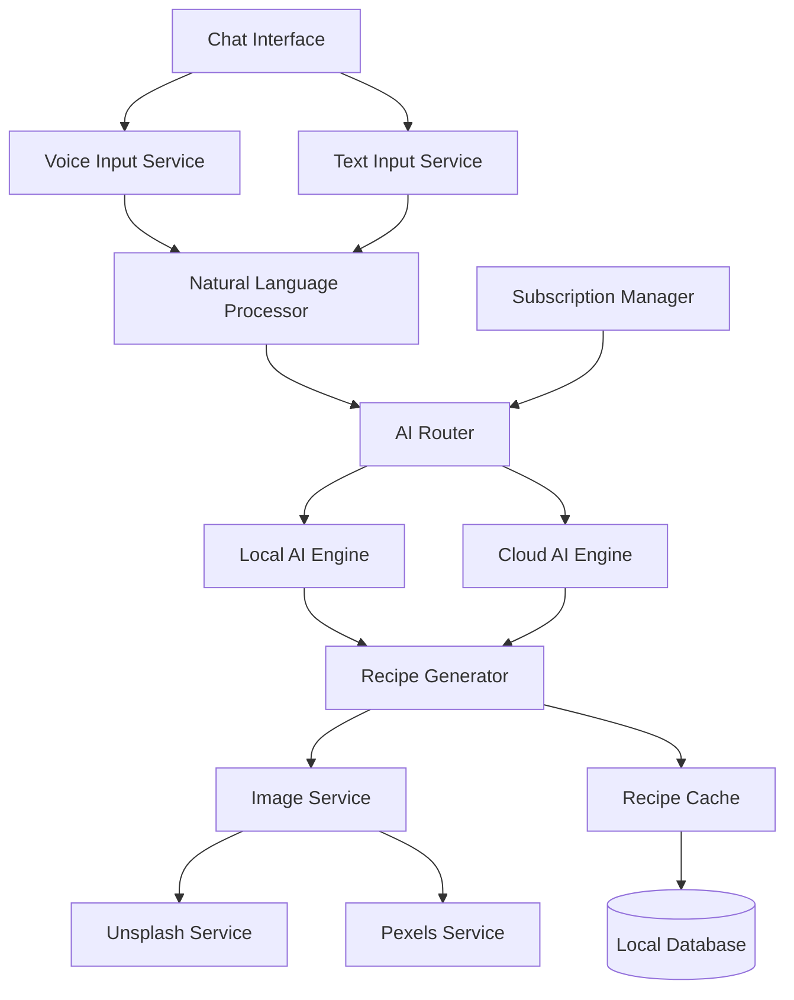

# Design Document

## Overview

The AI Recipe Generation system transforms user input (text or voice) into complete, personalized recipes through a hybrid architecture supporting both local and cloud AI processing. The system features a conversational chat interface, intelligent image matching, and tiered subscription model that balances offline capability with premium cloud features.

## Architecture

### High-Level Architecture



### Component Interaction Flow

1. **Input Processing**: Voice/text input → Natural Language Processor
2. **AI Routing**: Subscription tier determines Local vs Cloud AI
3. **Recipe Generation**: AI engine creates structured recipe JSON
4. **Image Enhancement**: Image service fetches relevant photos
5. **Caching & Storage**: Recipe stored locally with images
6. **UI Presentation**: Chat interface displays conversational recipe

## Components and Interfaces

### 1. Chat Interface Component

**Purpose**: Conversational UI for recipe requests and modifications

**Key Features**:
- Message history with user/assistant distinction
- Voice recording button with visual feedback
- Recipe card rendering within chat
- Typing indicators and loading states
- Recipe modification through follow-up messages

**Interface**:
```typescript
interface ChatMessage {
  id: string;
  type: 'user' | 'assistant' | 'recipe';
  content: string;
  timestamp: Date;
  voiceNote?: boolean;
  recipe?: Recipe;
}

interface ChatState {
  messages: ChatMessage[];
  isProcessing: boolean;
  currentSession: string;
}
```

### 2. AI Router Service

**Purpose**: Determines processing path based on subscription and connectivity

**Decision Logic**:
- Free + Offline → Local AI Engine
- Free + Online → Local AI Engine (with image fetching)
- Premium + Online → Cloud AI Engine
- Premium + Offline → Local AI Engine with cached premium features

**Interface**:
```typescript
interface AIRouterConfig {
  subscriptionTier: 'free' | 'premium';
  isOnline: boolean;
  localModelReady: boolean;
}

interface RecipeRequest {
  prompt: string;
  dietaryRestrictions?: string[];
  preferredCuisine?: string;
  cookingTime?: string;
  difficulty?: 'easy' | 'medium' | 'hard';
}
```

### 3. Local AI Engine

**Purpose**: Offline recipe generation using Llama 3.2 models

**Technical Specifications**:
- Model: Llama 3.2 1B/3B quantized (Q4)
- Context window: 2048 tokens
- Response time: <10 seconds on modern devices
- Storage: 800MB-2GB depending on model size

**Optimization Features**:
- Model quantization for reduced size
- GPU acceleration when available
- Prompt caching for common requests
- Progressive model loading

### 4. Cloud AI Engine

**Purpose**: Advanced recipe generation with premium features

**Capabilities**:
- Complex multi-course recipes
- Detailed nutritional analysis
- Recipe variations and substitutions
- Cultural context and cooking tips
- Multi-language support

**API Integration**:
- Primary: Claude Sonnet 4 for recipe generation
- Fallback: GPT-4 for redundancy
- Rate limiting and cost optimization

### 5. Image Service

**Purpose**: Intelligent recipe image matching and caching

**Image Sources Priority**:
1. Unsplash API (free tier: 50/hour)
2. Pexels API (unlimited free)
3. Local placeholder images
4. AI-generated images (premium only)

**Search Optimization**:
- Recipe name + cuisine type
- Key ingredients combination
- Cooking method descriptors
- Fallback to generic food categories

**Interface**:
```typescript
interface ImageSearchParams {
  recipeName: string;
  cuisine?: string;
  mainIngredients: string[];
  cookingMethod?: string;
}

interface ImageResult {
  url: string;
  source: 'unsplash' | 'pexels' | 'ai_generated' | 'placeholder';
  attribution?: string;
  cached: boolean;
}
```

### 6. Voice Input Service

**Purpose**: Speech-to-text conversion with cooking context awareness

**Technical Implementation**:
- React Native Voice library integration
- Expo Speech API for cross-platform support
- Background noise filtering
- Cooking terminology optimization

**Features**:
- Real-time transcription feedback
- Voice command recognition ("start recording", "generate recipe")
- Multi-language support (premium)
- Offline speech processing (basic)

### 7. Recipe Cache & Storage

**Purpose**: Local storage optimization for offline access and performance

**Storage Strategy**:
- SQLite for structured recipe data
- File system for cached images
- IndexedDB for web platform compatibility
- Automatic cleanup of old cached content

**Schema Design**:
```sql
-- Enhanced recipe table
CREATE TABLE recipes (
  id INTEGER PRIMARY KEY,
  name TEXT NOT NULL,
  description TEXT,
  ingredients JSON,
  instructions JSON,
  prep_time TEXT,
  cook_time TEXT,
  difficulty TEXT,
  cuisine TEXT,
  image_url TEXT,
  image_source TEXT,
  created_via TEXT, -- 'voice', 'text', 'manual'
  chat_session_id TEXT,
  ai_model_used TEXT,
  created_at DATETIME,
  updated_at DATETIME
);

-- Chat session tracking
CREATE TABLE chat_sessions (
  id TEXT PRIMARY KEY,
  user_id TEXT,
  started_at DATETIME,
  last_activity DATETIME,
  message_count INTEGER
);

-- Message history
CREATE TABLE chat_messages (
  id TEXT PRIMARY KEY,
  session_id TEXT,
  role TEXT, -- 'user', 'assistant'
  content TEXT,
  voice_input BOOLEAN,
  recipe_id INTEGER,
  created_at DATETIME,
  FOREIGN KEY (session_id) REFERENCES chat_sessions(id),
  FOREIGN KEY (recipe_id) REFERENCES recipes(id)
);
```

## Data Models

### Recipe Model
```typescript
interface Recipe {
  id: string;
  name: string;
  description: string;
  cuisine: string;
  difficulty: 'Easy' | 'Medium' | 'Hard';
  prepTime: string;
  cookTime: string;
  servings: number;
  ingredients: Ingredient[];
  instructions: Instruction[];
  nutrition?: NutritionInfo;
  tags: string[];
  imageUrl?: string;
  imageSource?: string;
  story?: string;
  variations?: string[];
  pairingIdeas?: string[];
  createdVia: 'voice' | 'text' | 'manual';
  aiModelUsed: string;
  chatSessionId?: string;
}

interface Ingredient {
  item: string;
  amount: string;
  notes?: string;
  substitutions?: string[];
}

interface Instruction {
  step: number;
  text: string;
  time?: string;
  tip?: string;
  temperature?: string;
}

interface NutritionInfo {
  calories: number;
  protein: string;
  carbs: string;
  fat: string;
  fiber?: string;
  sodium?: string;
}
```

### Chat Models
```typescript
interface ChatSession {
  id: string;
  userId: string;
  startedAt: Date;
  lastActivity: Date;
  messageCount: number;
  generatedRecipes: string[]; // Recipe IDs
}

interface ProcessingState {
  isListening: boolean;
  isTranscribing: boolean;
  isGenerating: boolean;
  currentStep: string;
  progress?: number;
}
```

## Error Handling

### Network Connectivity
- **Offline Detection**: Automatic fallback to local AI when network unavailable
- **Request Queuing**: Queue cloud requests when offline, process when online
- **Graceful Degradation**: Reduce features rather than complete failure

### AI Model Failures
- **Local Model Issues**: Fallback to cached recipes or simplified generation
- **Cloud API Failures**: Automatic retry with exponential backoff
- **Model Loading**: Progressive loading with user feedback

### Image Service Failures
- **API Rate Limits**: Automatic source switching (Unsplash → Pexels → Placeholder)
- **Image Loading**: Lazy loading with placeholder during fetch
- **Cache Misses**: Intelligent cache warming for popular recipes

### Voice Input Errors
- **Transcription Failures**: Allow manual text correction
- **Background Noise**: Noise filtering and retry prompts
- **Permission Denied**: Graceful fallback to text input

## Testing Strategy

### Unit Testing Focus
- AI prompt generation and parsing
- Recipe JSON validation
- Image URL validation and caching
- Voice transcription accuracy

### Integration Testing
- End-to-end recipe generation flow
- Offline/online mode switching
- Subscription tier feature access
- Cross-platform voice input

### Performance Testing
- Local AI model response times
- Image loading and caching efficiency
- Database query optimization
- Memory usage during model inference

### User Experience Testing
- Voice input accuracy in kitchen environments
- Recipe generation quality assessment
- Chat interface usability
- Offline functionality validation

## Security Considerations

### API Key Management
- Secure storage of Unsplash/Pexels API keys
- Cloud AI API key rotation
- Environment-based configuration

### User Data Privacy
- Local storage of chat history
- Optional cloud sync with encryption
- Voice data processing transparency
- Recipe sharing privacy controls

### Model Security
- Local AI model integrity verification
- Secure model download and updates
- Protection against prompt injection
- Content filtering for inappropriate requests

## Performance Optimization

### Local AI Optimization
- Model quantization (Q4/Q8 formats)
- GPU acceleration when available
- Prompt caching for common patterns
- Background model warming

### Image Optimization
- Progressive image loading
- WebP format preference
- Automatic image resizing
- Intelligent cache eviction

### Database Optimization
- Indexed searches on recipe attributes
- Batch operations for chat history
- Automatic database maintenance
- Query result caching

### Memory Management
- Lazy loading of chat history
- Image memory cleanup
- Model memory optimization
- Background task management